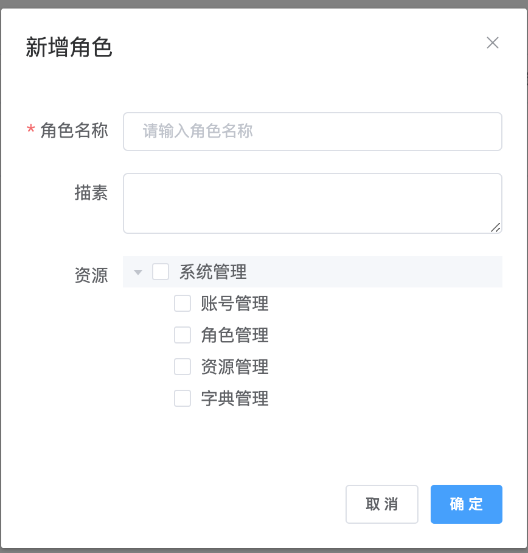
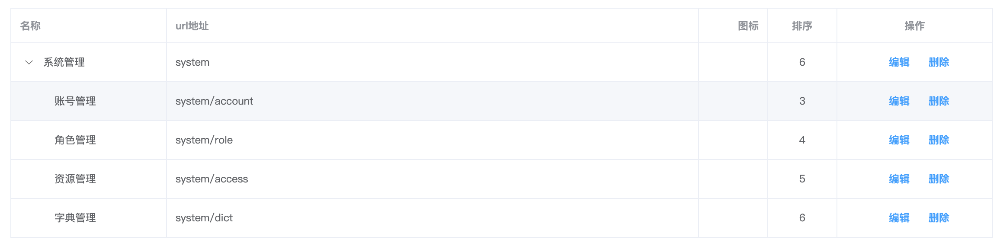

## 一、项目初始化
* 1、权限系统前端页面展示

  * 用户中心
  
  
  * 角色管理

  
  * 资源管理
  
  
  
* 2、主要提供的`API`
  
  
* 3、下载原代码及安装依赖包

* 4、根目录下创建一个`.env`的文件

  ```js
  // 端口号
  PORT = 4000;
  
  // mysql数据库配置
  DB_TYPE = mysql;
  DB_HOST = localhost;
  DB_USERNAME = root;
  DB_PASSWORD = root;
  DB_DATABASE = test;
  DB_PORT = 3306;
  DB_SYNCHRONIZE = false;
  DB_LOGGING = true;
  
  // jwt加盐
  SECRET = abc;
  // 前缀
  PREFIX = api/v1;
  ```

* 5、创建数据库及创建表(直接使用项目中的`sql`文件)

* 6、运行代码

  ```shell
  npm run start:dev
  # or
  npm run webpack
  npm run start1
  ```

## 二、主要实现功能

- [x] 使用`nestjs-config`和`dotenv`保存敏感数据及在项目中直接使用`ConfigService`[参考文档](https://docs.nestjs.com/techniques/configuration)
- [x] 使用`typeorm-model-generator`由数据库表迁移生成`*.entity.ts`文件[参考我的文章](https://blog.csdn.net/kuangshp128/article/details/98062662)
- [x] 使用`node-auth0`模块进行密码加密处理(见`src/core/user/user.entity.ts`)
- [x] 使用`jwt`对用户登录授权(见`src/shared/guard/auth.guard.ts`)
- [x] 封装了统一成功、失败数据返回格式,并在全局使用(见`src/shared/interceptor/transform.interceptor.ts`和`src/shared/filters/http-exception.filter.ts`)
- [x] 封装了用户提交数据错误提示(见`src/shared/pipe/validation.pipe.ts`)
- [x] 日志拦截器,用于记录各个请求访问时间(见`src/shared/interceptor/logging.interceptor.ts`)
- [x] 核心模块`curl`封装了`httpModule`模块的网络请求
- [x] 使用`@nestjs/swagger swagger-ui-express`生成`API`文档(见`src/main.ts`)
- [x] [安全方面](https://docs.nestjs.com/techniques/security)
- [x] `src/core`中添加上传附近模块[官网地址](https://docs.nestjs.com/techniques/file-upload)
- [x] 使用`webpack`热更新[官方文档](https://docs.nestjs.com/techniques/hot-reload)
- [x] 新增分页拦截器(`src/shared/interceptor/paginate.interceptor.ts`和`src/core/user/user.service.ts`)
- [x] 权限系统主要的功能
  * 采用`RBAC`的方式，实现用户关联角色(一对多关系)，角色关联资源(一对多的关系)

## 三、技术解答

> 本项目还在持续集成新功能进来,最后会加上前端做一个`cms`系统的`api`,后期会拉分支使用`graphql`提供`api`

- 1、有关于`nestjs`的技术问题可以直接加我微信<font color="#f00">备注:nest 开发</font>

  

- 2、如果你觉得本项目对你帮助很大,**给一个赞**
